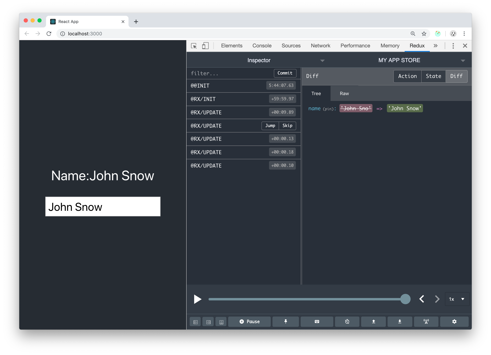

## DevTools

_ReState_ uses the excellent [Redux DevTools](https://github.com/zalmoxisus/redux-devtools-extension) to provide power-ups for your development workflow.



## Installation

Go and get the ReduxDevTools for your browser:

- [Google Chrome](https://chrome.google.com/webstore/detail/redux-devtools/lmhkpmbekcpmknklioeibfkpmmfibljd)
- [Firefox](https://addons.mozilla.org/en-US/firefox/addon/reduxdevtools/)

Then install the `ReState` dev-tools:

```
yarn add @restate/dev-tools
```

## Usage

```ts
import { connectDevTools } from '@restate/dev-tools'

const { store } = create({
  state: {
    name: 'John Snow',
    age: 32
  },
  options: {
    storeName: 'MY APP STORE' // <-- will show up in the instance selector
  }
})

connectDevTools(store)
```

Full example on https://stackblitz.com/edit/hello-restate
